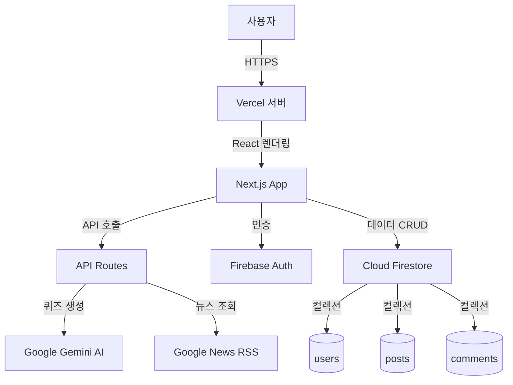
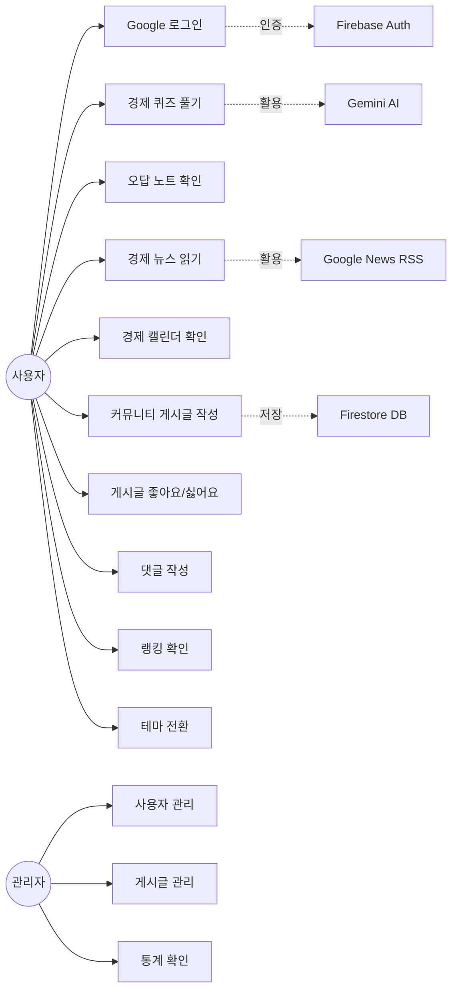
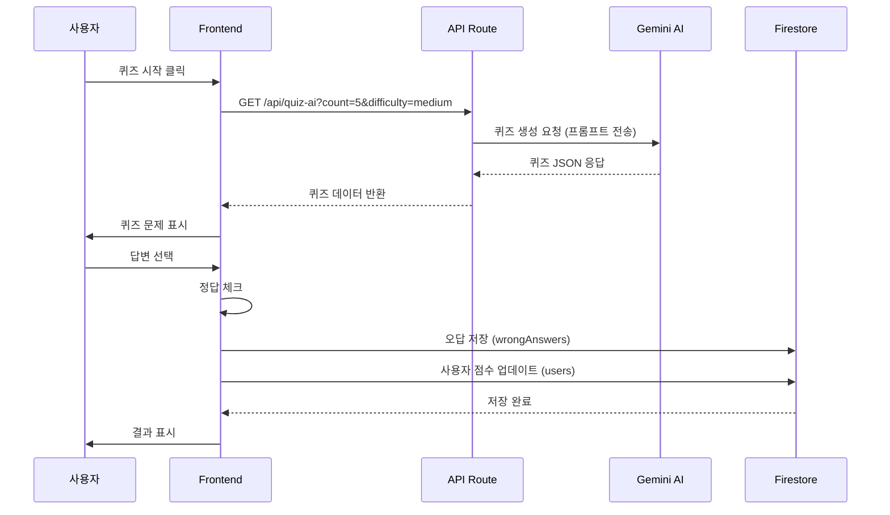
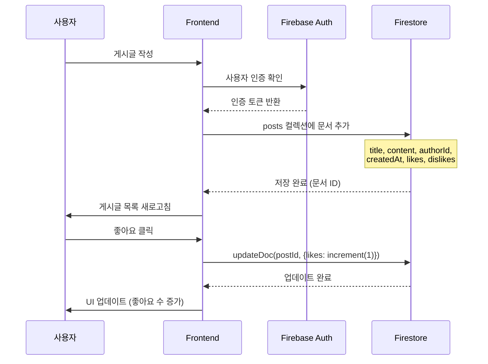
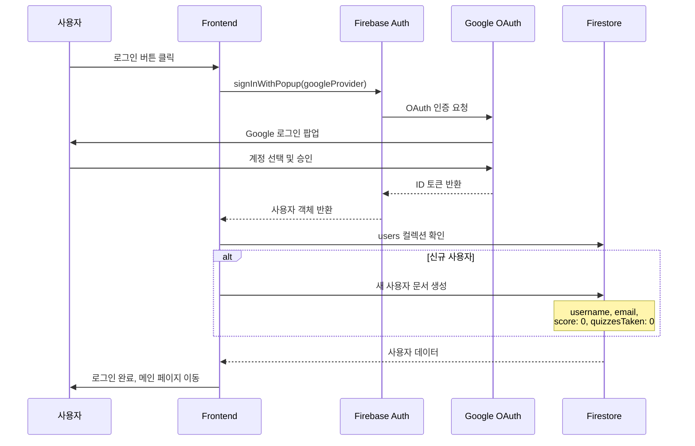
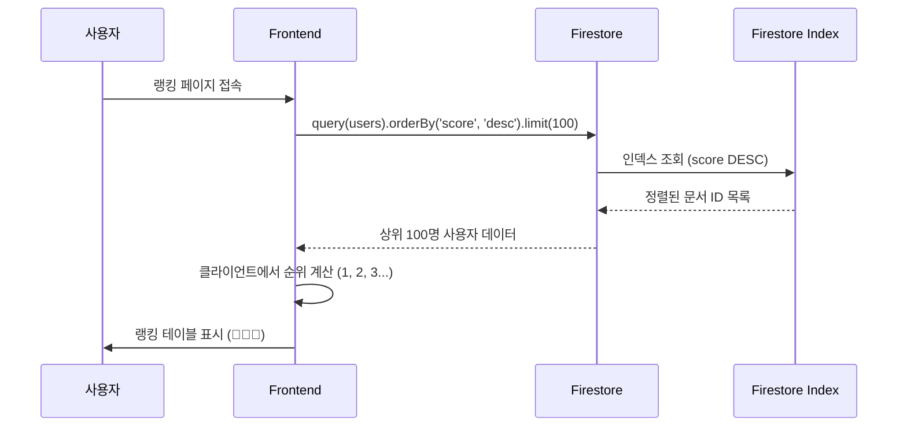

# Economy Lingo - 프로젝트 기술 명세서

## 📋 프로젝트 개요

**프로젝트명**: Economy Lingo  
**설명**: 경제 용어 학습을 위한 AI 기반 퀴즈 플랫폼  
**배포 URL**: https://economy-lingo.vercel.app  
**GitHub**: https://github.com/yeonjeyeong/economy-lingo

---

## 🛠️ 사용 기술 스택

### 프론트엔드
- **언어**: TypeScript, JavaScript
- **프레임워크**: Next.js 14 (React 기반)
- **스타일링**: CSS (Vanilla CSS with CSS Variables)
- **UI 라이브러리**: React Hooks, Context API

### 백엔드
- **런타임**: Node.js
- **API**: Next.js API Routes (서버리스 함수)
- **AI**: Google Generative AI (Gemini 2.0 Flash Lite)

### 데이터베이스 및 인증
- **데이터베이스**: Cloud Firestore (NoSQL)
- **인증**: Firebase Authentication (Google OAuth)
- **스토리지**: Firestore Collections

### 인프라 및 배포
- **호스팅**: Vercel (서버리스 배포)
- **버전 관리**: Git, GitHub
- **CI/CD**: Vercel 자동 배포

### 외부 API
- **뉴스 API**: Google News RSS Feed
- **경제 캘린더**: 수동 입력 데이터

---

## 📊 시스템 아키텍처



---

## 🎯 유스케이스 다이어그램



---

## 🔄 주요 시퀀스 다이어그램

### 1. 퀴즈 생성 및 응답 플로우



### 2. 커뮤니티 게시 및 상호작용 플로우



### 3. Google 로그인 플로우



### 4. 랭킹 조회 플로우



---

## 📁 데이터베이스 스키마

### Firestore Collections

#### 1. users
```typescript
{
  userId: string;           // 문서 ID (Firebase Auth UID)
  username: string;         // 사용자 이름
  email: string;            // 이메일
  score: number;            // 총 점수
  quizzesTaken: number;     // 푼 퀴즈 수
  avatar?: string;          // 프로필 이미지 URL
  createdAt: Timestamp;     // 계정 생성 시간
}
```

#### 2. posts
```typescript
{
  postId: string;           // 문서 ID (자동 생성)
  title: string;            // 게시글 제목
  content: string;          // 게시글 내용
  authorId: string;         // 작성자 ID (users 참조)
  authorName: string;       // 작성자 이름
  createdAt: Timestamp;     // 작성 시간
  likes: number;            // 좋아요 수
  dislikes: number;         // 싫어요 수
  commentCount: number;     // 댓글 수
  isDeleted: boolean;       // 삭제 여부 (소프트 삭제)
}
```

#### 3. comments (서브컬렉션: posts/{postId}/comments)
```typescript
{
  commentId: string;        // 문서 ID (자동 생성)
  postId: string;           // 부모 게시글 ID
  authorId: string;         // 작성자 ID
  authorName: string;       // 작성자 이름
  content: string;          // 댓글 내용
  createdAt: Timestamp;     // 작성 시간
}
```

#### 4. wrongAnswers (서브컬렉션: users/{userId}/wrongAnswers)
```typescript
{
  answerId: string;         // 문서 ID (자동 생성)
  question: string;         // 틀린 문제
  correctAnswer: string;    // 정답
  userAnswer: string;       // 사용자가 선택한 오답
  explanation: string;      // 해설
  timestamp: Timestamp;     // 오답 기록 시간
}
```

---

## 🔐 보안 규칙

### Firestore Security Rules
```javascript
rules_version = '2';
service cloud.firestore {
  match /databases/{database}/documents {
    match /{document=**} {
      allow read, write: if true;
    }
  }
}
```

> [!WARNING]
> 현재는 개발 단계로 모든 읽기/쓰기를 허용합니다.  
> 프로덕션 환경에서는 인증 기반 규칙으로 변경 필요.

---

## 🎨 주요 기능 명세

### 1. 경제 퀴즈 시스템
- **AI 생성**: Gemini AI가 난이도별 객관식 문제 생성
- **난이도**: 하/중/상 3단계
- **즉시 채점**: 클라이언트 사이드 채점
- **오답 노트**: 틀린 문제 자동 저장

### 2. 커뮤니티 시스템
- **게시글**: CRUD 기능
- **댓글**: 게시글별 댓글 작성
- **반응**: 좋아요/싫어요
- **소프트 삭제**: 관리자가 삭제한 게시글 복구 가능

### 3. 랭킹 시스템
- **실시간 순위**: Firestore 인덱스 기반 빠른 조회
- **메달 시스템**: 1-3위 메달 표시 (🥇🥈🥉)
- **점수 표시**: 점수 및 퀴즈 참여 횟수

### 4. 경제 뉴스
- **실시간 뉴스**: Google News RSS 파싱
- **카테고리**: 경제, 금융, 기업 뉴스
- **외부 링크**: 새 탭에서 원문 보기

### 5. 경제 캘린더
- **주요 일정**: 경제 지표 발표일 표시
- **중요도**: ⭐ 표시로 중요도 구분
- **일정 선택**: 특정 날짜 이벤트 조회

### 6. 다크 모드
- **테마 전환**: 라이트/다크 모드 토글
- **영구 저장**: localStorage로 선택 기억
- **전체 적용**: 모든 페이지 일관된 테마

### 7. 관리자 대시보드
- **사용자 관리**: 점수 수정, 삭제
- **게시글 관리**: 소프트 삭제, 복구, 영구 삭제
- **통계**: 총 사용자 수, 게시글 수, 평균 점수

---

## 🚀 배포 환경

### 환경 변수
```bash
# Firebase (Public - 브라우저 사용)
NEXT_PUBLIC_FIREBASE_API_KEY=***
NEXT_PUBLIC_FIREBASE_AUTH_DOMAIN=economy-lingo.firebaseapp.com
NEXT_PUBLIC_FIREBASE_PROJECT_ID=economy-lingo
NEXT_PUBLIC_FIREBASE_STORAGE_BUCKET=economy-lingo.firebasestorage.app
NEXT_PUBLIC_FIREBASE_MESSAGING_SENDER_ID=***
NEXT_PUBLIC_FIREBASE_APP_ID=***
NEXT_PUBLIC_FIREBASE_MEASUREMENT_ID=***

# Gemini API (Private - 서버 사이드)
GEMINI_API_KEY=***
```

### Vercel 설정
- **빌드 명령**: `npm run build`
- **출력 디렉토리**: `.next`
- **Node.js 버전**: 18.x
- **자동 배포**: main 브랜치 푸시 시

---

## 📈 성능 최적화

### Firestore 인덱스
```json
{
  "indexes": [
    {
      "collectionGroup": "posts",
      "fields": [
        {"fieldPath": "isDeleted", "order": "ASCENDING"},
        {"fieldPath": "createdAt", "order": "DESCENDING"}
      ]
    }
  ]
}
```

### Next.js 최적화
- **Server Components**: 기본 서버 렌더링
- **API Routes**: 서버리스 함수로 효율적 처리
- **CSS Variables**: 다크 모드 빠른 전환

---

## 🧪 테스트 및 검증

### 수동 테스트 체크리스트
- [x] Google 로그인/로그아웃
- [x] 퀴즈 생성 및 채점
- [x] 오답 노트 저장
- [x] 커뮤니티 게시글 CRUD
- [x] 댓글 작성
- [x] 좋아요/싫어요
- [x] 랭킹 조회
- [x] 경제 뉴스 조회
- [x] 경제 캘린더 조회
- [x] 다크 모드 전환
- [x] 관리자 기능

---

## 📝 향후 개선 사항

### 보안
- [ ] Firestore 보안 규칙 세분화
- [ ] Rate Limiting 구현
- [ ] CSRF 토큰 적용

### 기능
- [ ] 퀴즈 카테고리별 분류
- [ ] 사용자 프로필 페이지
- [ ] 알림 시스템
- [ ] 검색 기능

### 성능
- [ ] 페이지네이션 구현
- [ ] 이미지 최적화
- [ ] 캐싱 전략

---

## 👥 프로젝트 정보

**개발자**: yeonjeyeong  
**개발 기간**: 2025년 11월  
**라이선스**: MIT (또는 해당 라이선스)

---

**문서 버전**: 1.0  
**최종 업데이트**: 2025-11-25
